# Sound Localization Report

> **姓名：南亚，周泽龙**
> **学号：2016013257，2016013231**
> **课程：网络系统（2）**
> **日期：2019年12月1日**
>
> **分工：**
>
> > **南亚：二维定位、优化**
> > **周泽龙：一维测距、测试、报告**

------

[TOC]


## 1 实验原理

### 1.1 一维测距

​		利用 FMCW 信号频率与时间的关系，通过傅里叶变换计算接受信号的频率，再利用频率计算信号的传播时间的变化，从而计算目标与单个扬声器之间的距离变化。需要解决以下几个难点：

1. **近似同步接收信号**
   * 我们利用单个 chirp 信号与接收信号进行相关，并选择第一个峰值作为近似的起始点。截取峰值前信号，重复执行单个 chirp 信号相关，设置峰值阈值，即可得到第一个峰值。
2. **确定扬声器信号传输开始时间**
   * 引入扬声器信号伪传输开始时间 $t_0$。

​        基于以上，我们得到伪传输信号 Pseudo-transmitted signals，通过计算伪传输信号与接收信号之间的时间差，可以得到手机与扬声器的距离变化情况。

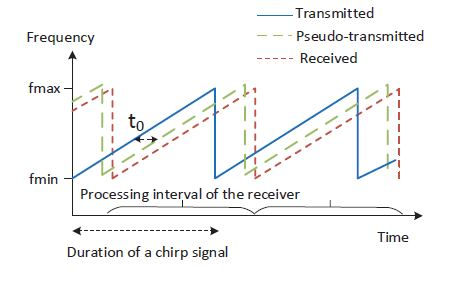

3. **确定 $t_0$**
   * 由于本次作业要求里允许假设初始位置，因此，可忽略 $t_0$，直接假定初始时手机与扬声器的距离为 $d_0$。根据 $d_0$，与距离变化情况，即可得到手机与扬声器之间的绝对距离。

4. **消除手机移动的影响**
   * 利用多普勒效应计算手机移动速度 $v_n$，然后消除手机速度带来的 FMCW 测距影响。

### 1.2 二维定位

​		利用两个扬声器，坐标分别为 $(0, 0)$ 和 $(0.4, 0)$，在一维测距的基础上分别测量手机与两个扬声器的距离。在每个测量点，以两个扬声器坐标为圆心，两个距离为半径，画圆求交点（只取一侧交点），该交点坐标即手机的二维坐标。需要解决以下几个难点：

1. **近似同步两个扬声器时钟**

   * 目的：确保测量得到的两个一维距离是手机在同一个位置上测得的。
   * 利用双声道，使两个喇叭同时播放不同频率的 chirp 信号。

2. **接收端区分两个扬声器的信号**

   * 可以利用带通滤波器过滤信号，但是实际的信号过滤效果并不理想。

   * 重新构造传输信号为：
     $$
     \begin{bmatrix}
     	chirp(2000Hz, 4000Hz, 0.04s)+doppler(0.04s) & zeros(0.01s) & zeros(0.04s) & zeros(0.01s) \\
     	zeros(0.04s) & zeros(0.01s) & chirp(8000Hz, 10000Hz, 0.04s) & zeros(0.01s)
     \end{bmatrix}
     $$

   * 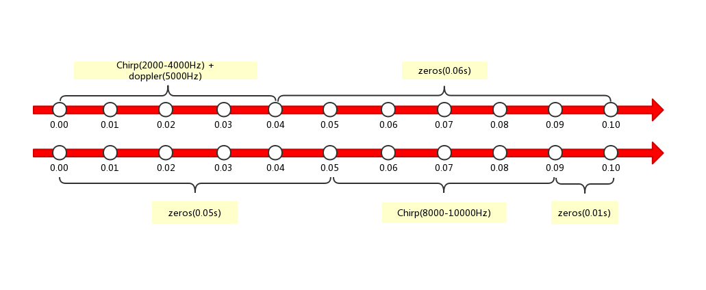

   * 左声道播放第一行信号，右声道播放第二行信号。

   * `doppler(0.04s)` 为单频余弦信号，用作测量多普勒效应。
   
   * 由于两个喇叭的 chirp 信号并非严格同时，这样会引入不可消除的系统误差，但还在可接受的范围内。


## 2 系统设计

### 2.1 系统架构

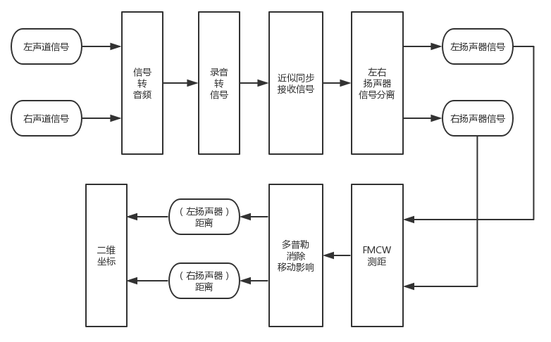

### 2.2 设备与设定

#### 2.2.1 实验设备

* 电脑：$1$ 台。
* 扬声器：$2$ 个（一对小音箱即可）。
* 手机：$1$ 台。
* 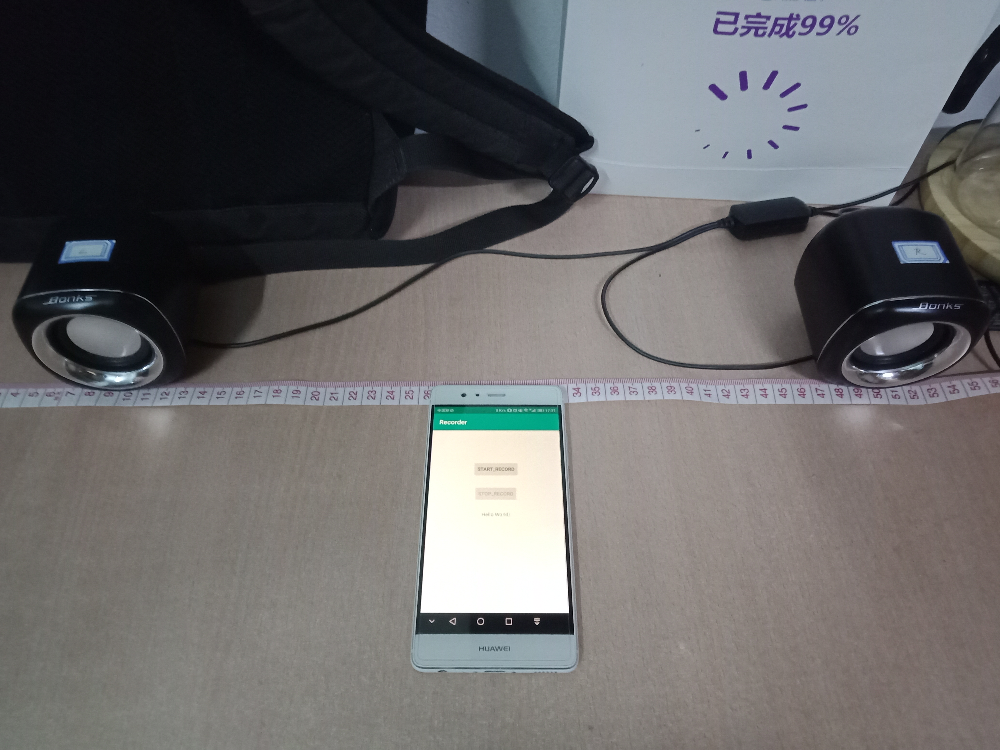

#### 2.2.2 实验设定

* 电脑连接一对小音箱，两个扬声器间距 $0.4m$ 。
* 使用电脑播放双声道音频 `output.wav` 。
* 手机录音，并从两个扬声器的 **中点** 作为起始点开始移动（只允许在两个扬声器连线的同一侧移动），得到 `received.wav` 。
* 执行 matlab 代码，解析录音文件，得到手机移动坐标变化。

### 2.3 源码结构与说明

```python
matlab
|-- Parameters.m	  # 系统参数
|-- ChirpSound.m      # 生成扬声器音频
|-- FMCWReceive.m	  # 测距与定位
|-- BPassFilter.m     # 滤波器
|-- Sinc.m            # 滤波器辅助函数
|
|-- sound			  # 音频文件夹
|	|-- output.wav    # 扬声器音频
|	|-- received.wav  # 录音音频
```

> ChirpSound.m
>
> > ChirpSound.m 是生成 Chirp 信号播放音频的 `Main` 文件。
> 
> FMCWReceive.m
>
> > FMCWReceive.m 是解析录音得到坐标变化的 `Main` 文件。


##  3 实验结果与分析

​		以下为 $7$ 组测试结果，其中，蓝色圆点为两个扬声器所在位置，蓝色曲线为实际移动轨迹，红色曲线为测量得到移动轨迹。

1.  **静止在起始点**
   * 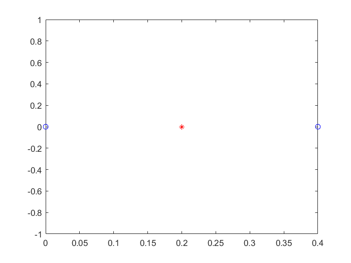
   * 实验结果符合预期。
2.  **移动测试**
   * **（1）**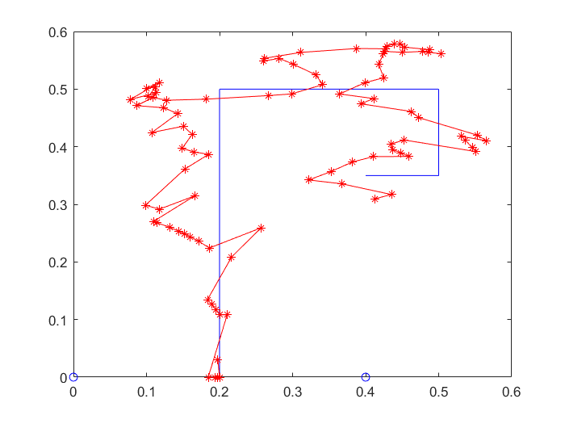
   * **（2）**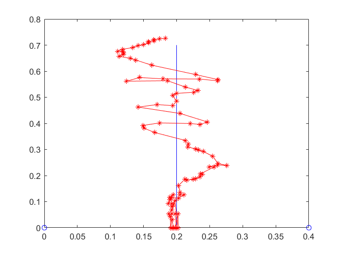
   * **（3）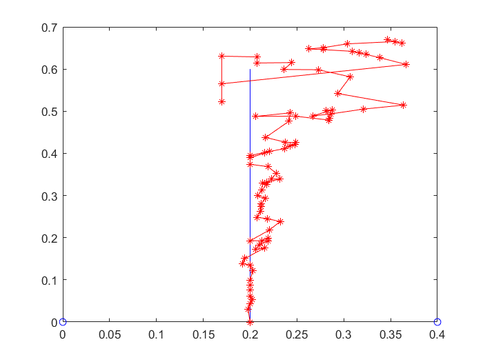**
   * **（4）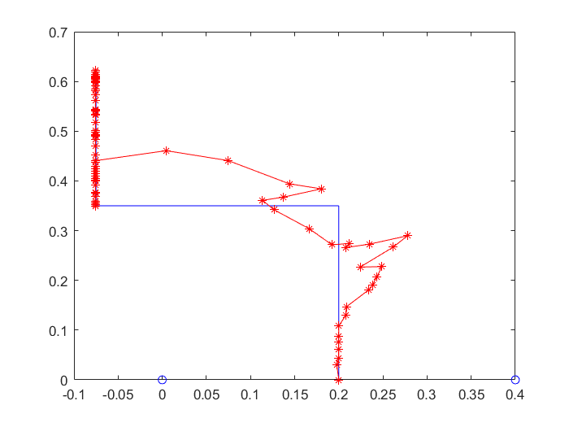**
   * **（5）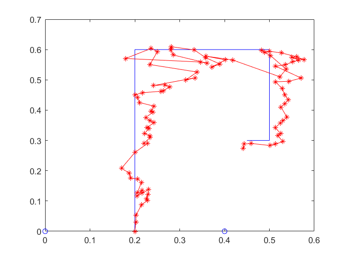**
   * **（7）**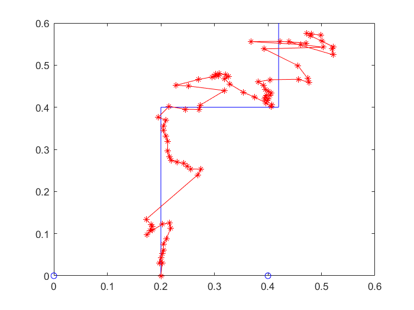
3.  **分析结论**
   * 测量得到的手机移动轨迹与实际移动轨迹大致相同。
   * 手机移动速度与测量精度成负相关，速度越快，误差越大。
   * 受设备发声、录音的影响，有效距离难以估计，在 $3m$ 左右范围内测得轨迹尚可接受。


## 4 设计特点

1. 利用 FMCW 测量距离，并利用多普勒效应消除移动带来的影响。
2. 设计良好的音频信号，利用双声道使两个喇叭发送不同 Chirp 信号。
